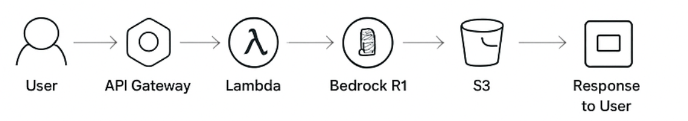

# AI-Powered-Blog-Generator

Generate AI-written blogs on any topic using AWS Lambda and Bedrock DeepSeek R1. Fully serverless, REST API-enabled, and stores output in Amazon S3.

### Features

**Automatic Blog Generation** – ~300-word blogs from a simple topic input.

**Serverless & Scalable** – Runs entirely on AWS Lambda with dynamic S3 storage.

**REST API Access** – Exposed via API Gateway; testable via Postman or other clients.

**Prompt Engineering** – Custom instruction formatting ensures coherent AI outputs.

**Error Handling & Logging** – Robust fallback for model response variations.

### Tech Stack

**Cloud**: AWS Lambda, API Gateway, S3, AWS Bedrock (DeepSeek R1),CloudWatch

**Programming**: Python

**Generative AI**: Large Language Models, Prompt Engineering, Inference Tuning

**Testing**: Postman

### How It Works

* User sends a POST request with a blog topic.
* Lambda calls DeepSeek R1 using invoke_model with custom prompt formatting.
* Generated content is stored in S3 with a topic-based key.
* Lambda returns a JSON response with S3 location and preview.

#### Example Request (Postman / HTTP)
**POST** - https://<api-gateway-endpoint>/generate-blog

* Content-Type: application/json

* {
  * "blog_topic": "Generative AI in Cloud Computing"
* }

#### Response
* {
  * "message": "Blog generated successfully",
  * "s3_location": "s3://blog-output-Generative_AI_in_Cloud_Computing.txt",
  * "content_preview": "Generative AI is revolutionizing cloud computing by enabling..."
* }

* Built serverless AI pipelines using AWS Lambda + Bedrock.

* Applied prompt engineering for LLM output optimization.

* Designed RESTful API endpoints and automated S3 storage.

* Implemented error handling and logging for AI response variations.
